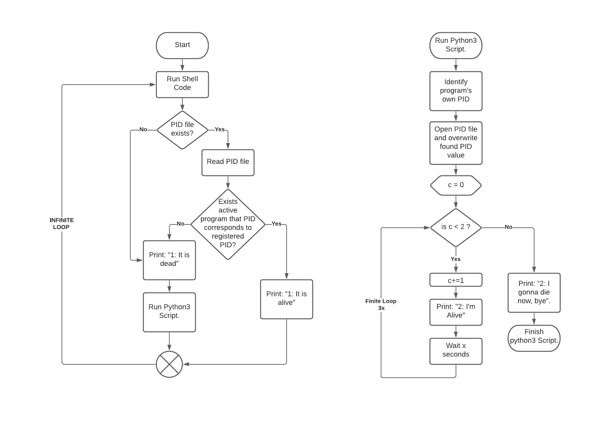

# cromai-bash-python-test

The objective of this test is to develop a simple software for the **Processo Seletivo Cromai | Case Time de Embarcados 2021**

It's possible to see the project rules and details in the following <a src = './CROMAI_Case Embarcados 2021.pdf' >PDF</a>.

What is expected in this case:

- I - Write a concept model code from the bash code and python code, for exemple a diagram or a pseudo-code.
- II - Write the shell script code.
- III - Write the code in python3.
- IV - Do the integration between the 2 codes.
- V - Discribe the differences between the concept model and what was implemented.
- VI - commit the code in github and send link.

### I - Concept model

The first step into solving a problem is to understand it. What is the possible solution? How to structure it? Which techniques are going to be used ? As well as be careful to not overengineer the solution giving more complexity than is actually necessary.

The more complex the problem, the harder is to connect all the ideas and structure the brainstorm into clear and defined steps.

A good way to do that is creating a concept model, in this case I created two, since we're integrating 2 scripts, each one with it's own life cycle.

It's possible to see it, in the following image: 


<center>Figure 1. At the left we can see the bash script model, at the right the python3 code model.</center>
<br>

### II - Shell script code
The shell script code as required was developed to run in linux OS, the OS used to develop this code it was Ubuntu.

```
#! /bin/bash

#Finding pid path with variable $pwd.
FILE="$(pwd)/pid"
while true
do
    #Checking if pid file exists, if it exists, read.
    if [ -f "$FILE" ]; then
        read -r pid<$FILE
        if ps -p $pid > /dev/null; 
        then
            # Do something knowing the pid exists, i.e. the process with $PID is running.
            echo 1: It is alive
            sleep 1
            continue
        fi
    fi
    #In case file doesn't exists or pid isn't running in system it executes python code.
    echo 1: It is dead
    python3 python_script.py &
    sleep 1
done
```
### III - Python3 script code
The python3 script code was developed using the python version 3.8.10

It wasn't necessary to import external libraries, only the native python libraries time **(to manage time waiting)** as well as OS **(to manage the PID tasks)**.

```
import time
import os

#Waiting time in seconds during iteration loop
x = 5
#Getting it's own pid in os.
pid = str(os.getpid())

#Writting pid in file.
f = open("pid", "w")
f.write(pid)
f.close()

for i in range (0,3):
    print ("2: I am alive")
    time.sleep(x)
else:
    print ("2: I gonna die now, bye")

```

### IV - Do the integration between the 2 codes.

As required the bash script code is responsable to run the python code and check if it's currently running in the system.

It is important to notice that if not required the bash script will run synchronously, that means when running the python3 code, the bash script will pause and wait for it to finish before continue the loop, to prevent that we used the following code:

```
 python3 python_script.py &
```
the letter ```&``` at the end of the command ensures that both scripts run independent from each other so the bash script can check if the python code is alive while it's running. The same technique can be used to run multiple scripts independently from each other.

### V - Differences between the concept model and implementation.

The given problem required a simple solution, and it had a set of well defined rules, but during the development, the focus was in reach the basic solution, that means solve the core problem from topics **I to VI** and leave it for later the extra points.

Because of that I can say that the model lacks of discribing the extra features which were, add the dockerfile with the project depencies as well as the log.

As discribed in the project rules, it wasn't necessary to fix the concept model, so, I left the model in it's first version.

